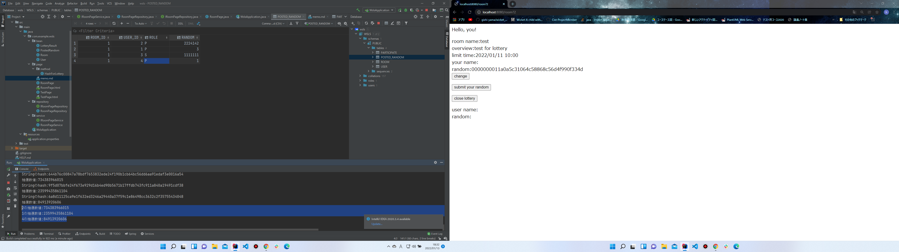

主催者はルーム作成と当時に乱数を提出する。

理由
主催者の乱数提出漏れを防ぐ

↑やっぱりなしで
主催者が乱数を変えたいときや後出ししたいときのために 
同時提出じゃなくてもいいや

2の抽選数値:23974030081488
1の抽選数値:84913920606
4の抽選数値:5241601652

2の抽選数値:734383966015
1の抽選数値:23599435861104
4の抽選数値:84913920606

2の抽選数値:268240897552
1の抽選数値:337296961356
4の抽選数値:296526352